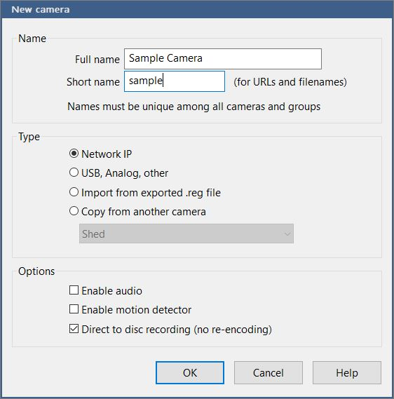
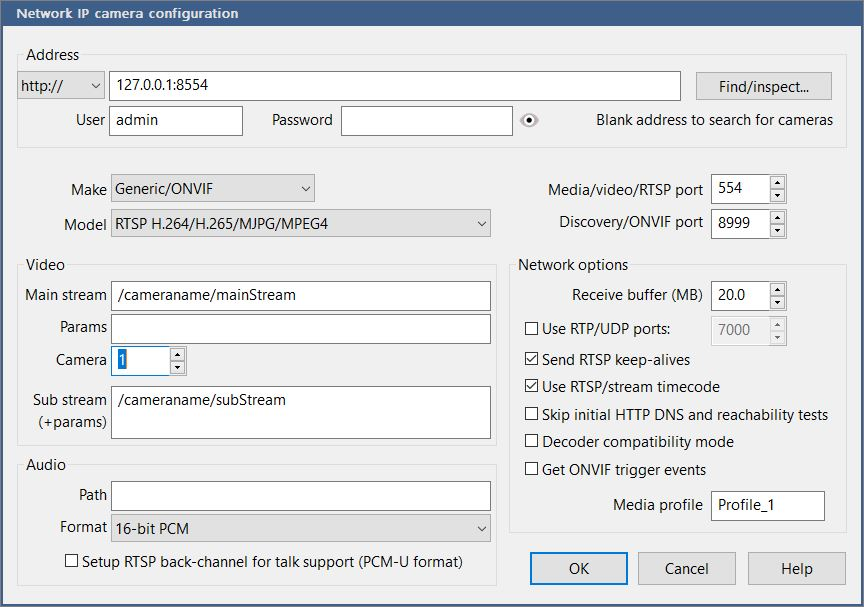

# Setting Up Neolink For Use With Blue Iris

Stock Reolink cameras do not support use with non-proprietary surveillance software such as Blue Iris. Neolink enables you to use your unsupported cameras with Blue Iris and other viewers/recorders. In this guide, you will learn how to configure your Reolink cameras and Neolink for use with Blue Iris software.

**This guide applies to the following camera models:**
- B800/D800
- E1

## Step One: Configuring Your Cameras
The first thing to do to make video recording run smoothly is tweak the settings on your Reolink Cameras so that they do not conflict with Neolink.

### 1. Update your Camera's firmware.
_The cameras have software bugs too, and Reolink is constantly working to fix them. Cameras ship with older versions which have **known bugs.** It's best to eliminate any unknown parameters when setting up your cameras._
1. Download the latest version of firmware for your camera at [Reolink's official firmware update site](https://support.reolink.com/hc/en-us/sections/360002374874-Firmware)
2. Unzip the firmware package.
3. Refer to [Reolink's official firmware upgrade guide](https://support.reolink.com/hc/en-us/articles/360004084333-Upgrade-Firmware-via-Reolink-Client-Windows-) for more information on how to upgrade firmware.

### 2. Assign a static IP address to your cameras
_This is the most reliable setup since Neolink cannot autodetect when a camera's IP address changes._
1. In the Reolink PC app, login to your camera.
2. Click "Device Settings" (the gear) -> "Network General."
3. Change "Connection Type" from "DHCP" to "Static."
4. Enter a static IP address compatible with your network (i.e. `192.168.1.15`)

_You will have to reconnect to the camera once you have changed the IP address_

### 3. Set the camera's time to your local network time.
_If the camera's time is not set, Neolink will recursively "time out" every one second and will not stream video._
1. In the Reolink PC app, login to your camera.
2. Click "Device Settings" -> "System General" -> "Synchronize Local Time."
3. Click "Ok."

### 4. Disable Auto Reboot
_When a camera reboots, it loses its date and time settings, causing Neolink to time out._
1. In the Reolink PC app, login to your camera.
2. Click "Device Settings" -> "Maintenance."
3. Uncheck "Enable Auto Reboot."

### 5. Set a Password
_It's recommended that you set a password for each of your cameras. If you want to use the Reolink Mobile App, it makes you set a password for each camera anyway._
1. In the Reolink PC app, login to your camera.
2. Click "Device Settings" -> "Manage User."
3. Click "Modify Password."

**Now you've set up your cameras!**

## Setting Up Neolink
### 1. Installation
Refer to [Neolink's README](https://github.com/thirtythreeforty/neolink/blob/master/README.md) for instructions on installing.
### 2. Create your config file.
The config file tells Neolink how to connect to your camera and serve the video streams.
Note: the config file's file extension _**must**_ be `.toml` to work properly.
1. Create a simple text file (i.g. `config.toml`) in the same directory you have unpacked Neolink with the following format:

        bind = "0.0.0.0"
        
        [[cameras]]
        name = "cameraname"
        username = "admin"
        password = "password"
        address = "192.168.1.10:9000"
        stream = "both"
    
2. Change `cameraname` to a legible, phonetic name that describes your camera. Leave the quotes around the name.
3. The default username is `admin`; leave this unless you've created another user.
4. Replace `password` with the password you set on the camera. If you chose to not use a password, remove this line from the config file. Again, leave the quotes.
5. Replace `192.168.1.10:9000` with the IP address you set for your camera. 
    Note: The port, `:9000`, should remain at the end of your IP address. This is the proprietary "media port" that Reolink uses.
6. The `stream` line allows you to choose which stream type to use. Neolink supports streaming two streams, the main-stream, and the sub-stream. It can stream either one, or both. If you wish to stream both streams, leave this line as is. If you wish to stream _only_ the main-stream, change `both` to `mainStream`. If you wish to stream only the sub-stream, change `both` to `subStream`.
7. For multiple cameras, copy and paste the entire `[[cameras]]` block below the first. Each camera entry must begin with `[[cameras]]`.

### 3. Start Neolink
1. Open a command prompt in the directory that contains Neolink and your config file.
2. Run the following command (with your correct config file name):

        neolink --config config.toml

You should get login messages that look something like this:

Note: Neolink hosts all streams on localhost port 8554. Each camera has a designated path for the sub-stream and the main-stream. Neolink gets the name of the path from the name of the camera you set in the config file. So the path to the sample camera's main-stream would be `127.0.0.1:8554/cameraname/mainStream` and the path to the sample camera's sub-stream would be `127.0.0.1:8554/cameraname/subStream`. The main-stream is also served on the root path to the camera.

**Now you have Neolink up and running!**

## Step Three: Setting up Blue Iris
_There are a few tricks to getting Blue Iris to work properly with Neolink's RTSP streams._

### 1. Add a new Camera
1. Click "Main Menu" -> "add new camera."

2. Give your camera a full name and a short name.
3. Uncheck "Enable Motion Detector."
4. Enable "Direct to disc recording."

5. Click "OK."

### 2. Configure the Camera

_Once you click "OK" on the "New Camera" window, Blue Iris should dump you directly into the camera configuration._

1. Leave protocol set to "http://."

   _Although we are using RTSP streams, Blue Iris does not allow the use of sub-streams if you set the protocol to RTSP._

2. In the address bar, enter `127.0.0.1:8554`. This will be the same for all cameras.
3. Clear the password field.
4. Set the "Main stream" path to `/cameraname/mainStream`, changing `cameraname` to the name of the camera you set in Neolink's config file.
5. Set the "Sub stream" path to `/cameraname/subStream`, also changing `cameraname` to the name of your camera.

6. Under "Network Options," set "Receive Buffer" to 20MB.

   _This is because the 4k cameras' key frames are so large._

7. Click "OK."

**Congrats, you have set up your first camera!**